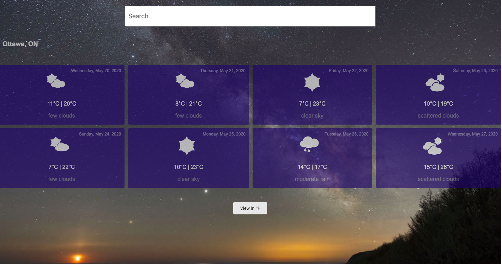

# ReactJS Weather App 

## Description 

This is a simple ReactJS project that invokes the OpenWeatherMap API in order to get a 7-day forecast. It also leverages Google's Geocode module to transform a location into coordinates. 

## The main goals of this project are:
1. Understand and create React Components
2. Understand the communication between parent and child components through props 
3. Make use of HTTP calls and implement an API service 
4. Understand and use state object

## OpenWeatherMap API 

In order to use this service, you must obtain an API key from [their website](https://openweathermap.org/price) and include it in a config file. 


## Geocoding API 

In order to use this service, you must obtain an API key from [their website](https://developers.google.com/maps/documentation/geocoding/start) and include it in a config file. 

## Run project

Make sure to clone the project and install all npm packages 

``` 
npm install 
```

To start the app: 

``` 
npm start
```

